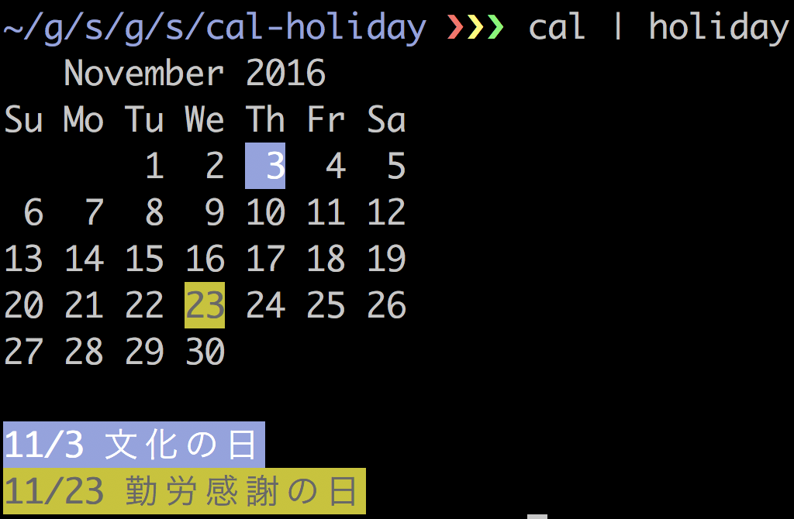

# japan holiday command for cal

## install

use golang

```
go get -u github.com/satoshun/cal-holiday/command/holiday
```


## usage

combines with cal command

show current month calendar with holiday

```sh
cal | holiday
```




## TODO

- corresponds shunbun, shuubunn day
- more hackable command
